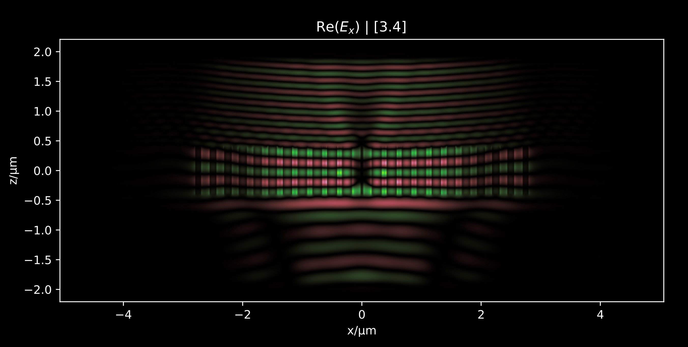

# wavesight

`wavesight` is a project to study the coupling of electromagnetic waves into optical fibers. It is written in Python and uses the `numpy` and `scipy` libraries for numerical calculations. It uses [MEEP](https://meep.readthedocs.io) as an implementation of FDTD to solve the propagation of waves across metasurfaces, and to launch the guided modes of step index fibers. It implements the analytical solution to step-index optical waveguides and it uses $ S^4 $ as an RCWA implementation useful in the design of metasurfaces. 

In addition to this it also uses the Smythe-Kirchhoff vectorial diffraction integral to propagate electromagnetic fields across homogeneous media that may compose a part of a larger structure. 

This was run at a HPC cluster at Brown University and includes a number of convenience to manage and launch scheduled jobs using [slurm](https://hpc-uit.readthedocs.io/en/latest/jobs/slurm_parameter.html).

From these calculations `wavesight` also provides a set of tools to visualize the results of the simulations. It uses `matplotlib` to plot the results of the simulations, and `ffmpeg` to generate animations of the results. These results are logged to a private Slack channel.

<picture>
  <source media="(prefers-color-scheme: dark)" srcset="./img/propagator_dark.jpg">
  <source media="(prefers-color-scheme: light)" srcset="./img/propagator_light.jpg">
  
</picture>