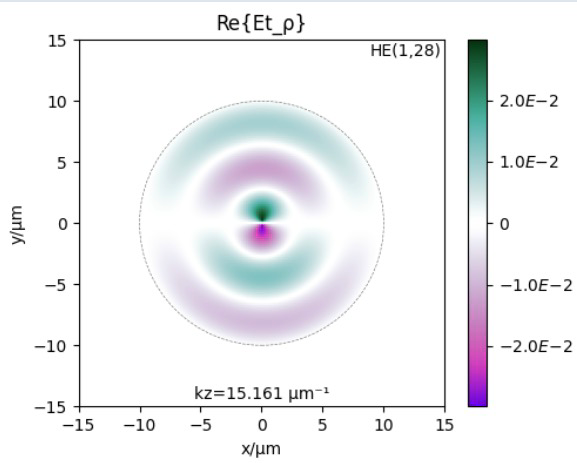

# wavesight

`wavesight` is a set of tools that may be used to the folowing ends:

* to find the modes in idealized optical waveguides,
* estimate the launch fields once they undergo refraction across a planar interface,
* and calculate the propagation of these fields across a homogeneous space using an implementation of the Rayleigh-Sommerfeld diffraction integral.

<center>  </center>


## File: fieldgen.py
### Ezgen_1(Ae,  m,  γ)
### Ezgen_2(Be,  m,  β)
### Hzgen_1(Ah,  m,  γ)
### Hzgen_2(Bh,  m,  β)
### Et1genρ(Ae,  Ah,  Be,  Bh,  m,  β,  γ,  kz,  λfree,  nCladding,  nCore)
### Et1genφ(Ae,  Ah,  Be,  Bh,  m,  β,  γ,  kz,  λfree,  nCladding,  nCore)
### Et2genρ(Ae,  Ah,  Be,  Bh,  m,  β,  γ,  kz,  λfree,  nCladding,  nCore)
### Et2genφ(Ae,  Ah,  Be,  Bh,  m,  β,  γ,  kz,  λfree,  nCladding,  nCore)
### Ht1genρ(Ae,  Ah,  Be,  Bh,  m,  β,  γ,  kz,  λfree,  nCladding,  nCore)
### Ht1genφ(Ae,  Ah,  Be,  Bh,  m,  β,  γ,  kz,  λfree,  nCladding,  nCore)
### Ht2genρ(Ae,  Ah,  Be,  Bh,  m,  β,  γ,  kz,  λfree,  nCladding,  nCore)
### Ht2genφ(Ae,  Ah,  Be,  Bh,  m,  β,  γ,  kz,  λfree,  nCladding,  nCore)
### Ez(ρ)
### Hz(ρ)
### Et1ρ(ρ)
```Docstring:
Returns the radial component of Et1 sans the global phase factor e(imϕ).
Parameters
----------
ρ : float
    The radial coordinate.
Returns
-------
Et1ρ : complex
```
### Et1φ(ρ)
```Docstring:
Returns the azimuthal component of Et1 sans the global phase factor e(imϕ).
Parameters
----------
ρ : float
    The radial coordinate.
Returns
-------
Et1ϕ : complex
```
### Et2ρ(ρ)
```Docstring:
Returns the radial component of Et2 sans the global phase factor e(imϕ).
Parameters
----------
ρ : float
    The radial coordinate.
Returns
-------
Et2ρ : complex
```
### Et2φ(ρ)
```Docstring:
Returns the azimuthal component of Et2 sans the global phase factor e(imϕ).
Parameters
----------
ρ : float
    The radial coordinate.
Returns
-------
Et2ϕ : complex
```
### Ht1ρ(ρ)
```Docstring:
Returns the radial component of Ht1 sans the global phase factor e(imϕ).
Parameters
----------
ρ : float
    The radial coordinate.
Returns
-------
Ht1ρ : complex
```
### Ht1φ(ρ)
```Docstring:
Returns the azimuthal component of Ht1 sans the global phase factor e(imϕ).
Parameters
----------
ρ : float
    The radial coordinate.
Returns
-------
Ht1ϕ : complex
```
### Ht2ρ(ρ)
```Docstring:
Returns the radial component of Ht2 sans the global phase factor e(imϕ).
Parameters
----------
ρ : float
    The radial coordinate.
Returns
-------
Ht2ρ : complex
```
### Ht2φ(ρ)
```Docstring:
Returns the azimuthal component of Ht2 sans the global phase factor e(imϕ).
Parameters
----------
ρ : float
    The radial coordinate.
Returns
-------
Ht2ϕ : complex
```
## File: wavesight.py
### tmfungen(λfree,  n1,  n2,  a)
```Docstring:
This function returns the eigenvalue function for TM(0,m) modes.

The expressions for the eigenvalue functions are generated in the
accompanying Mathematica notebook "wavesight.nb".

Parameters
----------
λfree : float
    Free space wavelength in μm.
n1 : float
    Core refractive index.
n2 : float
    Cladding refractive index.
a : float
    Core radius in μm.

Returns
-------
tm : function
```
### tefungen(λfree,  n1,  n2,  a)
```Docstring:
This function returns the eigenvalue function for TE(0,m) modes.

The expressions for the eigenvalue functions are generated in the
accompanying Mathematica notebook "wavesight.nb".

Parameters
----------
λfree : float
    Free space wavelength in μm.
n1 : float
    Core refractive index.
n2 : float
    Cladding refractive index.
a : float
    Core radius in μm.

Returns
-------
te : function
```
### hefungen(λfree,  m,  n1,  n2,  a)
```Docstring:
This function returns the eigenvalue function for HE(n,m) modes.

The expressions for the eigenvalue functions are generated in the
accompanying Mathematica notebook "wavesight.nb".

Parameters
----------
λfree : float
    Free space wavelength in μm.
n1 : float
    Core refractive index.
n2 : float
    Cladding refractive index.
a : float
    Core radius in μm.
m : int
    Order of the HE mode.

Returns
-------
he : function
```
### multisolver(fiber_spec,  solve_modes,  drawPlots,  verbose,  tm_te_funcs)
```Docstring:
This function solves the propagation constants of a step-index fiber with the given specifications. This assuming that the cladding is so big that it is effectively infinite.

The propagation constants determine the z-dependence of the fields along the z-direction. The propagation constants are always bounded by what would be the plane wave wavenumbers in the cladding or in the core (assuming they were homogeneous).

Parameters
----------
fiber_spec : dict with the following keys:
    nCore : float
        The refractive index of the core.
    nCladding : float
        The refractive index of the cladding. If NA is given then
        nCladding is computed to be consistent with the given nCore
        and given NA.
    coreRadius : float
        The radius of the core in μm.
    free_space_wavelength : float
        The wavelength of the light in free space in μm.
    grid_divider: int, not necessary here but when later
        used in the layout generator, this is used to determine
        the fineness of the grid by making it equal to
        λfree / max(nCore, nCladding, nFree) / grid_divider
solve_modes: str either 'all' or 'transvserse'
drawPlots : bool, optional
    Whether to draw plots of the mode profiles. The default is False.
verbose : bool, optional
    Whether to print out extra information. The default is False.
tm_te_funcs : bool, optional
    If True then the return dictionary includes the keys tmfun and tefun. The default is False.

Returns
-------
sol : dict with all the keys included in fiber_spec plus these following others:
    kzmax : float
        2π/λfree * nCladding (no kz larger than this)
    kzmin : float
        2π/λfree * nCore (no kz smaller than this)
    Vnum : float
        The V number of the fiber.
    numModesFromVnum: float
        The number of modes according to the V number.
    totalNumModes : int
        The total number of modes that were found.
    tmfun : function
        The eigenvalue function for the TM modes.
    tefun : function
        The eigenvalue function for the TE modes.
    hefuns : dict
        The eigenvalue functions for the HE modes. The keys are values of m (m ≥ 1).
    TMkz : array
        The propagation constants of the TM(0,n) modes.
    TEkz : array
        The propagation constants of the TE(0,n) modes.
    HEkz : dict
        The propagation constants of the HE(m,n) modes. The keys are values of m (m ≥ 1). The values are arrays with the kz(m,n) propagation constants.
```
### Ae(modetype,  a,  n1,  n2,  λfree,  m,  kz)
### Ah(modetype,  a,  n1,  n2,  λfree,  m,  kz)
### Be(modetype,  a,  n1,  n2,  λfree,  m,  kz)
### Bh(modetype,  a,  n1,  n2,  λfree,  m,  kz)
### AeAhBeBh(modetype,  a,  n1,  n2,  λfree,  m,  kz)
### coordinate_layout(fiber_sol)
```Docstring:
Given a fiber solution, return the coordinate arrays for plotting
and coordinating the numerical analysis.
Parameters
----------
fiber_sol : dict
    A dictionary containing the fiber solution. It needs to have
    at least the following keys:
    - 'coreRadius' : float
        The radius of the core.
    - 'claddingIndex' : float  
        The refractive index of the cladding.
    - 'coreIndex' : float
        The refractive index of the core.
    - 'free_space_wavelenegth' : float
        The wavelength of the light in free space.

Returns
-------
a, b, Δs, xrange, yrange, ρrange, φrange, Xg, Yg, ρg, φg, nxy, crossMask : tuple
a : float
    The radius of the core.
b : float
    The side of the computational domain.
Δs : float
    The sampling resolution in the x-y direction. Assumed to be half the 
    wavelength in the core.
xrange, yrange : 1D arrays
    The coordinate arrays for the x-y directions.
ρrange, φrange : 1D arrays
`   The coordinate arrays for the ρ-φ directions in the cylindrical system.
Xg, Yg : 2D arrays
    The coordinate arrays for x-y.
ρg, φg : 2D arrays
    ρg has the values for the radial coordinate, φg has the values for the
    azimuthal coordinate.
nxy : 2D array
    The refractive index profile of the waveguide.
crossMask : 2D array
    A mask that is True where the core is and False where the cladding is.
```
### calculate_numerical_basis(fiber_sol)
```Docstring:
Given a solution for the propagation modes of an optical waveguide, calculate a numerical basis.

Parameters
----------
fiber_sol : dict
    A dictionary containing the fiber solution. It needs to have
    the following keys:
    - 'coreRadius' : float
        The radius of the core.
    - 'nCladding' : float
        The refractive index of the cladding.
    - 'nCore' : float
        The refractive index of the core.
    - 'free_space_wavelenegth' : float
        The wavelength of the light in free space.
    - 'totalModes' : int
        The total number of calculated modes.
    - 'TEkz' : 1D dict
        A single key equal to m=0, the values are array with
        the TE modes propagation constants.
    - 'TMkz' : 1D dict
        A single key equal to m=0, the values are array with
        the TM modes propagation constants.
    - 'HEkz' : 1D dict
        Keys are m values, values are 1D arrays of kz values.

Returns
-------
fiber_sol : dict:
    The same dictionary as the input, but with two new keys:
    - 'coord_layout' : tuple
        The tuple returned by the coordinate_layout function.
    - 'eigenbasis' : 5D np.array
        The numerical basis. The first dimension is the mode number,
        the second dimension only has two values, 0 and 1, 0 for the
        E  field, and 1 for the H field. The third dimension is used
        for  the  different components of the corresponding field in
        cylindrical  coordinates.  The  first index being the radial
        component,  the  second index being the azimuthal component,
        and  the  third  index  being  the  z component. Finally the
        fourth  and fifth dimensions are arrays that hold the values
        of   the  corresponding  field  components.  The  modes  are
        enumerated  such that first all TE modes are given, then all
        TM modes, and finally all HE modes. This same enumeration is
        the one used for the 'eigenbasis_nums' key.
    - 'eigenbasis_nums': list of tuples
        A  list  of  tuples,  each  tuple has nine values, the first
        value  is  a  string, either 'TE', 'TM', or 'HE', the second
        value is value of m, and the third value is the value of  n.
        The  order  in  this list is so that the i-th element of the
        list  corresponds  to  the  i-th mode in the eigenbasis. The
        fourth  and  fifth values are for the transverse propagation
        constants  the fourth one being the one inside the core, and
        the fifth one being the one outside the core. From the sixth
        to the ninth values are the values for Ae, Ah, Be, and Bh.
```
### poyntingrefractor(Efield,  Hfield,  nxy,  nFree,  verbose)
```Docstring:
Approximate  the  refracted  field across a planar interface
using  the Poynting vector as an analog to the wavevector of
a plane-wave.

Any  evanescent  fields  are  ignored. All cases where there
would  be  total  internal reflection the refracted field is
set to zero.

Parameters
----------
Efield : np.array (3, N, M)
    The electric field incident on the interface.
Hfield : np.array (3, N, M)
    The H-field incident on the interface.
nxy : np.array    (N, M)
    The refractive index transverse to the interface inside the incident medium.
nFree : float
    The refractive index of the homogeneous refractive medium.
verbose : bool, optional
    Whether to print or not progress messages, by default False.

Returns
-------
Eref, Href : tuple of np.array (3, N, M)
    The refracted electric and magnetic fields.
```
### farfield_projector(nearfield,  L,  λmedium,  farfield_extent,  dz,  replicas)
```Docstring:
This function takes a nearfield and projects it into the farfield.

Parameters
----------
nearfield : np.ndarray
    The nearfield to be projected. The last two indices in the given array
    must correspond to positions x, y along the transverse direction. Those
    two dimensions must have the same number of elements.

L : float
    The lateral extent of the nearfield in µm. The nearfield is assumed to
    be square. This, together with the number of elements in the transverse
    direction, determines the sampling resolution of the nearfield.

λmedium: float
    The wavelength of the light in the medium in µm.

farfield_extent : float
    Ditance between the plane at whicih the neafield is given and the last
    plane at which the farfield is computed.

dz : float
    Approximate resolution at which the farfield is sampled. It is approximate
    since the farfield is sampled at discrete points. At the end the actual
    used resolution is implied in the returned array for farfield_zaxis.

replicas : int, optional
    To avoid artificat from using the finite Fourier transform, the nearfield
    is replicated in the transverse direction. This parameter controls the
    number of padding zeroes that are used around the given fields. 
    The default is 1.

Returns
-------
(farfield_zaxis, farfield ): tuple, in which
    farfield_zaxis : np.ndarray
        The z-axis at which the farfield is sampled.
    farfield : np.ndarray
        An array with four indices. The first index corresponds to the component
        of the field. The second index corresponds to the position along the z-axis.
        Together with farfield_zaxis this index can be used to determine the 
        The last two indices correspond to the transverse coordinates.
```
### from_cyl_cart_to_cart_cart(field)
```Docstring:
Given  a  field  in  cylindrical  coordinates, convert it to
cartesian  coordinates.  The  given  field  is assumed to be
anchored  to a cartesian coordinate system in the sense that
each  of the indices in its array corresponds to a cartesian
grid  in the usual sense but the value of the vector at that
position is given in terms of cylindrical coordinates.

This  function  assumes  that  the  region  described by the
cartesian coordinates is a squar centered on the axis.

Parameters
----------
field : np.ndarray
    A  field  in  cylindrical  coordinates  with  shape  (3,
    numSamples,  numSamples) the indices being the ρ, φ, and
    z components respectively.

Returns
-------
ccfield : np.ndarray
    A   field   in  cartesian  coordinates  with  shape  (3,
    numSamples,  numSamples) the indices being the x, y, and
    z components respectively of the given vector field.
```
### angular_farfield_propagator(field,  λFree,  nMedium,  Zf,  Zi,  si,  sf,  Δf,  options)
```Docstring:
This function approximates the farfield of a field given the nearfield
and the propagation distance.

This is done by using the angular spectrum method. In which the Fourier
transform of the nearfield is understood to describe the coeffients that
approximate the farfield as the superposition of plane waves.

It assumes that the nearfield is given on a square grid perpendicular to
the z-axis. The farfield is also given on a square grid perpendicular to
the z-axis.

The farfield is approximated by the following formula:
    Efar = (2π 1j / kFree) * ((Zf-Zi)/Rfsq) * np.exp(1j*kFree*Rf) * S2
     with
    S2 equal to the Fourier transform extrapolated to the position
    of the farfield.

Parameters
----------
field : np.array (3, Ni, Ni) or (Ni, Ni) or (1, Ni, Ni)
    An array describing the nearfield of the field to be propagated.
nMedium : float
    Refractive index of the homogenous medium or propagation.
Zf : float
    The z-coordinate of the farfield.
Zi : float
    The z-coordinate of the nearfield.
si : float
    The size of the nearfield.
sf : float
    The size of the farfield.
Δf : float (optional)
    Spatial resolution of the farfield. If None, it is set to Δi.
options : dict (optional)
    A dictionary of options for the function. The options are:
        'return_fourier' : bool
            If True, the function also returns the Fourier transform of the
            nearfield.
        'return_as_dict' : bool
            If True, the function returns a dictionary with the following
            keys:
                'Efar' : np.array (3, Nf, Nf)
                    The farfield of the field.
                'Efourier' : np.array (3, Ni, Ni)
                    The Fourier transform of the nearfield.
            If False, the function returns the two arrays in the same order
            as the keys in the dictionary.

Returns
-------
Return depends on the options dictionary, see above.
```
### scalarfieldprop(Lobs,  z,  apertureFunction,  λfree,  nref,  numSamples)
```Docstring:
    scalarfieldprop  takes  a  field  component in an aperture plane and
    propagates  that  to an observation plane by using an implementation
    of  the  direct  integration  of the Rayleigh-Sommerfeld diffraction
    integral.  This  implementation  is based on the method described in
    Shen and Wang (2006). The field is sampled in the aperture plane and
    in  the obserbation plane using a uniform grid. The field is assumed
    to be zero outside of the aperture plane.

    Parameters
    ----------
    +  Lobs  (float): spatial width of the obsevation region, in μm. The
    observation  region  is  assumed to be a squared centered on (x,y) =
    (0,0),  and  extending  from  -Lobs/2  to Lobs/2 in both the x and y
    directions.

    + z (float): distance between the aperture plane and the observation
    plane, given in μm. The aperture plane is assumed to be at z=0.

    +  apertureFunction  (function):  a bi-variate function that returns
    the  complex  amplitude of the field in the aperture plane. Input to
    the function is assumed to be in cartesian coordinates x,y.  If  the
    function has an attribute "null" set to True, then the function will
    simply return a matrix of zeros.

    + λfree (float): wavelength in vaccum of field, given in μm.

    + nref (float): refractive index of the propagating medium.

    Options
    -------
    +  "numSamples"  (int or Automatic): number of samples to use in the
    aperture  plane  and  the  observation  plane. The aperture plane is
    sampled  using  a  uniform  grid,  and the observation plane is also
    sampled using a uniform grid. The default is Automatic in which case
    numSamples  is  calculated  so that the sample size is equal to half
    the wavelength of the wave inside of the propagating medium.

    Returns
    -------
    (numSamples, xCoords, yCoords, field) (tuple)
    +  xCoords (np.array): x coordinates of the observation plane, given
    in μm.

    +  yCoords (np.array): y coordinates of the observation plane, given
    in μm.

    +   field   (np.array):  complex  amplitude  of  the  field  in  the
    observation  plane.  The top left corner of the array corresponds to
    the  lower  left  corner  of  the observation plane. The coordinates
    associated with each element in the given array should be taken from
    xCoords and yCoords.

    References
    ----------
    +   Shen,   Fabin,  and  Anbo  Wang.  "Fast-Fourier-transform  based
    numerical integration method for the Rayleigh-Sommerfeld diffraction
    formula." Applied optics 45, no. 6 (2006): 1102-1110.

    Example (double slit):
    ----------------------

    def doubleSlit(separation, width, height):
        def apertureFun(x, y):
            return np.where((
                            ((np.abs(x - separation/2) <= width/2) | (np.abs(x + separation/2) <= width/2))
                            & (np.abs(y) <= height/2)
            ), 1, 0)
        return apertureFun

    slitSep = 4.
    slitWidth = 1.
    slitHeight = 10.
    Lobs = 100.
    z = 100
    nref = 1
    λfree = 0.532
    numSamples = 'auto'

    apFun = doubleSlit(slitSep, slitWidth, slitHeight)

    # Estimate the diffraction pattern from the simplified formula
    diforders = range(10)
    xmaxi = []
    for diforder in diforders:
        stheta = diforder * λfree / slitSep
        if stheta > 1:
            break
        else:
            theta = np.arcsin(stheta)
            xdif = z * np.tan(theta)
            if np.abs(xdif) <= Lobs/2:
                xmaxi.append(xdif)
                xmaxi.append(-xdif)


    numSamples, xCoords, yCoords, field = scalarfieldprop(Lobs, z, apFun, λfree, nref, numSamples)

    extent = (xCoords[0], xCoords[-1], yCoords[0], yCoords[-1])
    pField = np.abs(field)
    fig, ax = plt.subplots(figsize=(10,10))
    ax.imshow(pField,
            extent=extent,
            cmap=cmr.ember,
            interpolation='spline16')
    ax.scatter(xmaxi, np.zeros_like(xmaxi), s=20, facecolors='none', edgecolors='w', alpha=0.5)
    ax.set_xlabel('x/μm')
    ax.set_ylabel('y/μm')
    ax.set_title('Diffraction pattern of a double slit
s=%.2fμm | w=%.2fμm | L=%.2fμm | Δz=%.2fμm' % (slitWidth, slitWidth, slitHeight, z))
    plt.show()
    
    
```
### vectorfieldprop(Lobs,  z,  apertureFunctions,  λfree,  nref,  numSamples)
```Docstring:
vectorfieldprop  takes a field with three cartesian components in an
aperture  plane and propagates that to an observation plane by using
an  implementation  of  the  direct  integration  of  the  Rayleigh-
Sommerfeld diffraction integral. This implementation is based on the
method  described  in  Shen and Wang (2006). The field is sampled in
the  aperture  plane  and  in  the obserbation plane using a uniform
grid. The field is assumed to be zero outside of the aperture plane.
No  checks  are  made  that  the given field components constitute a
valid electromagnetic field. It assumes that the refractive index is
isotropic.

Parameters
----------
+  Lobs  (float): spatial width of the obsevation region, in μm. The
observation  region  is  assumed to be a squared centered on (x,y) =
(0,0),  and  extending  from  -Lobs/2  to Lobs/2 in both the x and y
directions.

+ z (float): distance between the aperture plane and the observation
plane, given in μm. The aperture plane is assumed to be at z=0.

+ apertureFunctions (tuple): a tuple with three bi-variate functions
which  return  the  complex  amplitude  of  the  corresponding field
cartesian component in the aperture plane. Input to the functions is
assumed  to  be in cartesian coordinates x,y. If the function has an
attribute "null" set to True, then the function will simply return a
matrix of zeros.

+ λfree (float): wavelength in vaccum of field, given in μm.

+ nref (float): refractive index of the propagating medium.

Options
-------
+  "numSamples"  (int or Automatic): number of samples to use in the
aperture  plane  and  the  observation  plane. The aperture plane is
sampled  using  a  uniform  grid,  and the observation plane is also
sampled using a uniform grid. The default is Automatic in which case
numSamples  is  calculated  so that the sample size is equal to half
the wavelength of the wave inside of the propagating medium.

Returns
-------
(numSamples, xCoords, yCoords, field) (tuple)
+  xCoords (np.array): x coordinates of the observation plane, given
in μm.

+  yCoords (np.array): y coordinates of the observation plane, given
in μm.

+  fields  (np.array):  with shape (3, numSamples, numSamples) where
the  first  index takes values 0, 1, 2 for the x, y, and z cartesian
components  and  the second two indices are anchored to positions in
the  obervation plane according to xCoords and yCoords. The top left
corner  of  the  array  corresponds  to the lower left corner of the
observation plane.

References
----------
+   Shen,   Fabin,  and  Anbo  Wang.  "Fast-Fourier-transform  based
numerical integration method for the Rayleigh-Sommerfeld diffraction
formula." Applied optics 45, no. 6 (2006): 1102-1110.
```
### tm(kz)
### te(kz)
### he(kz)
### gr(r)
## File: convstore.py
### sendtome(message)
```Docstring:
Given a message, send it to my phone via iMessage.
Parameters
----------
message : str
    The message to send.
Returns
-------
None
```
### zerocrossings(numarray)
```Docstring:
Return the indices of the zero crossings in the given numpy array.
```
### count_shared_chars(s1,  s2)
```Docstring:
Given two strings, count the number of characters that are the same
at the beginning of both strings.

Parameters
----------
s1 : str
s2 : str

Returns
-------
shared_count : int
    How many characters are the same at the beginning of both strings
    until the first character that is different.
```
### findallroots(fun,  xmin,  xmax,  dx,  dtype,  xtol,  max_iter,  num_sigfigs,  razorsharp,  method,  verbose)
```Docstring:
Find  all  roots of a function in a given interval. To accomplish this
the  function  is  sampled  with  the  given  resolution dx within the
interval  (xmin,  xmax)  and  the  zero  crossings are found. The zero
crossings  are  then  used  as  initial  guesses  for the root finding
algorithm.

At  the  end of the search, the roots are disambiguated by rounding to
the  specified  number  of  significant figures. This is done to avoid
returning multiple roots that are very close to each other.

When  a  method  is  given  which  requires a bracket, this bracket is
estimated  by  slightly increasing the position for the zero crossing.
This  might  not  give  an  adequate  bracket  for  the  root  finding
algorithm,  so  it  it expanded until the function effectively changes
sign.  If the function does not change after max_fixes iterations, the
root is skipped.

The roots are returned in a sorted array.

Parameters
----------
fun : function
    The function to find the roots of, must be univariate.
xmin : float
    The lower bound of the interval to search for roots.
xmax : float
    The upper bound of the interval to search for roots.
dx : float
    The step size to use when searching for roots.
xtol : float, optional
    The tolerance to use when searching for roots.
max_iter : int, optional
    The maximum number of iterations to use when searching for roots.
num_sigfigs : int, optional
    The number of significant figures to use when disambiguating similar roots.
razorsharp : float, optional
    The amount to expand the bracket for the root finding algorithm.
method : str, optional
    The method to use when searching for roots.  Must be one of the following:
    'bisect', 'brentq', 'brenth', 'ridder', 'toms748', 'secant'.
verbose : bool, optional
    If True, print information about the roots as they are found.

Returns
-------
zeros : array
```
### find_layout_rectangle(ar,  N)
### round2sigfigs(x,  p)
```Docstring:
Round x to p significant figures.

REF: https://stackoverflow.com/questions/18915378/rounding-to-significant-figures-in-numpy
```
