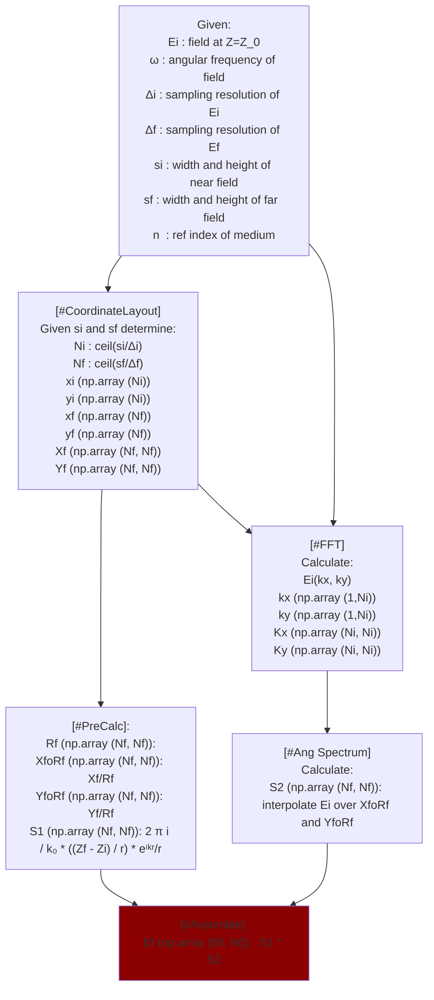

# Farfield approximation via the angular-spectrum representation

Given a scalar field in a plane $(z=Z_0)$, sampled in a square grid with a spatial resolution $\delta$, calculate the field at a different plane $(z=Z)$ with $k(Z-Z_0) >> 1 $ at the same spatial resolution $\delta$ but in a larger (or smaller) spatial domain. The calculated field should satisfy criteria for conservation of energy. 

This calculation assumes the field to be monochromatic (with angular frequency $\omega$). Even though in here the details are only given for the propagation of a scalar wave, this also applies to vector waves, in that each component should be propagated as if it was a scalar wave.

```

┌──────────────────────────────────────────────────────────────────────────┐
│                                                                          │
│                                                                          │
│                                                                          │
│                                                                          │
│                                                                          │
│                                                                          │
│        z=Zf                                                              │
│       ─ ─ ─ ─ ─ ─ ─ ─ ─ ─ ─ ─ ─ ─ ─ ─ ─ ─ ─ ─ ─ ─ ─ ─ ─ ─ ─ ╳ ─ ─        │
│                                                            ╱             │
│                                                           ╱              │
│                                                          ╱               │
│                                                         ╱                │
│                                                        ╱                 │
│                                                       ╱                  │
│                                                      ╱                   │
│                                                     ╱                    │
│                                                    ╱                     │
│                                                   ╱                      │
│                                                  ╱                       │
│                                                 ╱                        │
│                                                ╱  R                      │
│                                               ╱                          │
│                                              ╱                           │
│                                             ╱                            │
│                                            ╱                             │
│                                           ╱                              │
│                                          ╱                               │
│                                         ╱                                │
│                                        ╱                                 │
│                                       ╱                                  │
│                                      ╱                                   │
│                                     ╱                                    │
│                       ─ ─ ─ ─ ─ ─ ─╱─ ─ ─ ─ ─  z=Zi                      │
│                                                                          │
│                                                                          │
│                                                                          │
│                                                                          │
└──────────────────────────────────────────────────────────────────────────┘

```


