```mermaid
flowchart TB

Start["Given:
----------------------------------------
ϕ(x,y)    : pol. independent phase profile of ML
(θᵢ, φᵢ)  : orientation of emission dipole
nCry      : refractive index of crystal host
λfree     : free-space wavelength of monochromatic field
Δ         : distance between fiber's end face and metalens
V         : destination volume
ΔF        : spatial resolution of fields
D         : metalens aperture diameter
f         : paraxial focal length of ML
ρ(x,y,z)  : location probability
a         : the radius of the waveguide core
b         : side of computational square
nCore     : ref index of core
nCladding : ref index of cladding
nFree     : ref index of launching space
----------------------------------------"]

Start --> Modes["[#fiberModes-Calc]
Calculate the guided modes EH1ₙ of the step-index fiber.
"]

Modes  -->  Poynting["[#forEachMode-Calc]
For each EH1ₙ find the refracted fields (EH2ₙ) across the fiber boundary using they Poynting approximation."]

Poynting --> FreeProp["[#freeProp-Calc]
Propagate (EH2ₙ) across the gap between fiber and metalens. 
Let the field incident on the metalens be (EH3ₙ)"]

FreeProp --> MetaLens["[#metaREF-Calc]
Use the phase profile ϕ(x,y) to approximate the propagation of (EH3ₙ) across the metalens. 
Add heuristic constraints that approximate realistic phase pickups. 
Let the field right after the metalens be called EH4ₙ."]

MetaLens -->  HostProp["[#hostProp-Calc]
Propagate EH4ₙ across the destination volume V. Whereas EH1-4 are fields evaluated on a plane, the resultant field here is evaluated on a volume."]

HostProp --> ForEachOrientation["[#forEachOrientation-Calc]
For each dipole orientation (θᵢ, φᵢ) estimate at each evaluation point of the destination volume V what would be the coupling efficiency into the current mode. 
This should produce/use as many 3D arrays as dipole orientations there are. 
In principle one would like to keep one such array for each mode, in practice it might be necessary to simply keep a running total.
"]

ForEachOrientation --> OrientationRepeat["Repeat for each (θᵢ, φᵢ)."]

OrientationRepeat --> ForEachOrientation

OrientationRepeat --> ModeRepeat["Repeat for each mode"]

ModeRepeat --> Poynting

```

# Coupling the emission of a dipole emitter to a multimode waveguide with an intermediate meta-optic

```

┌───────────────────────────────────────────────────────────────────────┐         
│ ..................................│.................................. │         
│ ...................╔═════════════════════════════╗................... │   ◎     
│ ...................║.............................║................... │   │     
│ ...................║..............│...θ,φ........║... crystal host .. │   │     
│ ...................║. V ................┌▶.......║................... │   │     
│ ...................║..................┌─┘........║................... │   │     
│ ...................║..............┴.┌─┘..........║................... │   │     
│ ...................║............( ┌─┘............║................... │  EH5    
│ ...................║............┌─┴'─┐...........║................... │   │     
│ ...................║..........┌─┘.│..└─┐.........║................... │   │     
│ ...................║........┌─┘........└─┐.......║................... │   │     
│ ...................║.......◀┘............└─┐.....║................... │   │     
│ ...................║..............│........└─┐...║................... │   │     
│ .      ............╚═════════════════════════╩═╦═╝................... │   ◎     
│ . nCry ........................................└─┐................... │         
│ .      ...........................│..............└─┐................. │         
│ ...................................................└┐................ │◎─── EH4 
│ ─────── nnnnnnnnnnnnnnnnnnnnnnnnnnnnnnnnnnnnnnnnnnnnnnnnnnnnn ───ML── │         
│    ▲    ◁──────────────────────── D ─────────────────┼──────▷         │◎─── EH3 
│    │                                                 └┐               │         
│    │                                                  │               │         
│                                   │                   └┐              │         
│    Δ                                                   │              │         
│                                                        └┐             │         
│    │                              │                     │             │         
│    │                                                    └┐            │         
│    │                                                     └┐           │         
│    ▼                              │                       └┐          │◎─── EH2 
│  ─ ─ ─ ─ ─ ─ ─ ─ ─ ─ ─ ─ ─ ─ ─ ─ ─ ─ ─ ─ ─ ─ ─ ─ ─ ─ ─ ─ ─ ┴─┬ ─ ─ ─  │         
│ --------------||||||||||||||||||||||||||||||||||||||||||-----└──┐---- │◎─── EH1 
│ --------------||||||||||||||||||||│|||||||||||||||||||||--------└─┐-- │         
│ --------------||||||||||||||||||||||||||||||||||||||||||----------└─┐ │         
│ --------------||||||||||||||||||||||||||||||||||||||||||------------└─│         
│ -- cladding --||||||||||||||||| core |||||||||||||||||||------------- │         
│ --------------||||||||||||||||||||||||||||||||||||||||||------------- │         
│ --------------||||||||||||||||||||||||||||||||||||||||||------------- │         
│ --------------||||||||||||||||||||│|||||||||||||||||||||------------- │         
│ --------------◁──────────────────2a ───────────────────▷------------- │         
│ --------------||||||||||||||||||||||||||||||||||||||||||------------- │         
│ ◁──────────────────────────────── b ───────────────────────────────▷- │         
└───────────────────────────────────────────────────────────────────────┘         

```


