```mermaid
flowchart TB

Start["
START
----------------------------------------
Given in 💾 metalens_spec-[design_name].json
----------------------------------------
emDepth     : depth of emitter in crystal host
Δz          : uncertainty in depth
Δxy         : transverse uncertainty in position
----------------------------------------
nHost       : refractive index of crystal host
λfree       : free-space wavelength of monochromatic field
D_ML        : metalens aperture
nFree       : ref index space between waveguide and ML
----------------------------------------
coreRadius  : the radius of the waveguide core
nCore       : ref index of core
nCladding   : ref index of cladding
----------------------------------------
post_height : the height of the cylindrical posts for ML
lattice_c   : lattice constant of hexagonal lattice
min_ML_size : the minimum diameter of ML cylindrical posts
----------------------------------------
numG        : number of basis elements used in S4
------------------------------------------
"]

Start --> Aux["[#paramExpand-Calc]
Calculated by param_expander.py
------------------------------------------
Stored in 💾 metalens_full_spec-[design_name]-[now].json 
together with values in metalens_spec-[design_id].json
------------------------------------------
wg_to_EH2 : gap between waveguide and monitor where fields are stored
EH3_to_ML : gap between EH3 and ML
ML_to_EH4 : gap between ML and EH4
source_to_face : gap between mode source and fiber end
------------------------------------------
focal_length : focal length of ML for grazing coupling
fiber_to_ml  : distance between fiber's end face and ML for grazing coupling
Δfields      : spatial resolution of fields
ϵHost        : electric permitivitty of crystal host
ϵFree        : electric permitivitty of space between waveguide and ML
------------------------------------------
NAfiber   : nominal numerical aperture of waveguide given nCore and nCladding
Δfield    : spatial resolution of fields adequate for simulation
sxy       : length in μm of cross section adequate to describe all fields
------------------------------------------
now       : int of time of when this design was considered included in filename
------------------------------------------
"]

Start & Aux --> MetaDesigner["[#metasurf-Design]
Executed by meta_designer.py 
------------------------------------------
Results stored in metalens-[design_name>-[now].h5
-------------- from S4 -------------------
post_widths : widths of cylindrical posts for phase/geom curve
post_phases : corresponding phases
------------------------------------------
phase_geom_clipped_widths : accounting for min_ML_size
phase_geom_clipped_phases : corresponding to the above
------------------------------------------
numPosts       : number of posts that make the metasurface
post_phases    : required phases for necessary phase profile
lattice_points : (x,y) coords of post centers
post_radii     : corresponding post widths in μm
------------------------------------------
"] 

Start & Aux --> Modes["[#fiberModes-Calc]
Executed by fiber_bundle.py. This script computes the 
propagation constants of the waveguide modes, and  it
schedules the jobs necessary to determine how the corresponding
launched fields launch across the end face of the fiber.
This script assigns a waveguide_id, it is a
random alpha-numeric code for the waveguide.

Resulting data for the waveguide solution is 'waveguide_sol-' + waveguide_id + '.pkl'
"]

Modes  -->  FDTDRef["[#forEachMode-Calc]
Initiated by fiber_bundle.py, which sets up a series of cluster
jobs that use fiber_platform.py to actually run the
FDTD simulation for each mode. 
Once all of these jobs finish the fiber_plotter.py script
is automatically executed and this generates a set of plots
that show the fields as they refracted from the end face of the
waveguide.
Optionally one can also create animations of the refracted fields
by using fiber_animate.py.
"]

FDTDRef --> FreeProp["[#freeProp-Calc]
Executed by fiber_bridge.py
This script propagates the EH2ₙ fields from the position of the
output monitor of the fiber_platform.py simulations to the position
of the input plane of the metalens.
The fields at this plane are the EH3ₙ.
"]

FreeProp & MetaDesigner --> MetaLens["[#metaREF-Calc]
Executed by script across_ML.py
Using EH3ₙ as the fields incident on the designed metasurface
The fields at the output plane are the EH4ₙ."]

MetaLens -->  HostProp["[#hostProp-Calc]
Executed by H4-toH5.py
Propagate EH4ₙ across the destination volume V. 
Whereas EH1-4 are fields evaluated on a plane, 
the resultant fields here are evaluated on a volume."]

```

# Coupling the emission of a dipole emitter to a multimode waveguide with an intermediate meta-optic

```

┌───────────────────────────────────────────────────────────────────────┐         
│ ..................................│.................................. │         
│ ...................╔═════════════════════════════╗................... │   ◎     
│ ...................║.............................║................... │   │     
│ ...................║..............│...θ,φ........║... crystal host .. │   │     
│ ...................║. V ................┌▶.......║................... │   │     
│ ...................║..................┌─┘........║................... │   │     
│ ...................║..............┴.┌─┘..........║................... │   │     
│ ...................║............. ┌─┘............║................... │  EH5    
│ ...................║............┌─┴'─┐...........║................... │   │     
│ ...................║..........┌─┘.│..└─┐.........║................... │   │     
│ ...................║........┌─┘........└─┐.......║................... │   │     
│ ...................║.......◀┘............└─┐.....║................... │   │     
│ ...................║..............│........└─┐...║................... │   │     
│ .      ............╚═════════════════════════╩═╦═╝................... │   ◎     
│ . nH   ........................................└─┐................... │         
│ .      ...........................│..............└─┐................. │         
│ ...................................................└┐................ │◎─── EH4 
│ ─────── uuuuuuuuuuuuuuuuuuuuuuuuuuuuuuuuuuuuuuuuuuuuuuuuuuuuu ───ML── │         
│    ▲    ◁────────────────────── D_ML ────────────────┼──────▷         │◎─── EH3 
│    │                                                 └┐               │         
│    │                                                  │               │         
│                                   │                   └┐              │         
│    Δ                                                   │              │         
│                                                        └┐             │         
│    │                              │                     │             │         
│    │                                                    └┐            │         
│    │                                                     └┐           │         
│    ▼                              │                       └┐          │◎─── EH2 
│  ─ ─ ─ ─ ─ ─ ─ ─ ─ ─ ─ ─ ─ ─ ─ ─ ─ ─ ─ ─ ─ ─ ─ ─ ─ ─ ─ ─ ─ ┴─┬ ─ ─ ─  │         
│ --------------||||||||||||||||||||||||||||||||||||||||||-----└──┐---- │◎─── EH1 
│ --------------||||||||||||||||||||│|||||||||||||||||||||--------└─┐-- │         
│ --------------||||||||||||||||||||||||||| nCore ||||||||----------└─┐ │         
│ --------------||||||||||||||||||||||||||||||||||||||||||------------└─│         
│ -- cladding --||||||||||||||||| core |||||||||||||||||||------------- │         
│ --------------||||||||||||||||||||||||||||||||||||||||||------------- │         
│ --nCladding---||||||||||||||||||||||||||||||||||||||||||------------- │         
│ --------------||||||||||||||||||||│|||||||||||||||||||||------------- │         
│ --------------◁───────────── 2 coreRadius ─────────────▷------------- │         
│ --------------||||||||||||||||||||||||||||||||||||||||||------------- │         
│ ◁──────────────────────────────── b ───────────────────────────────▷- │         
└───────────────────────────────────────────────────────────────────────┘         

```


