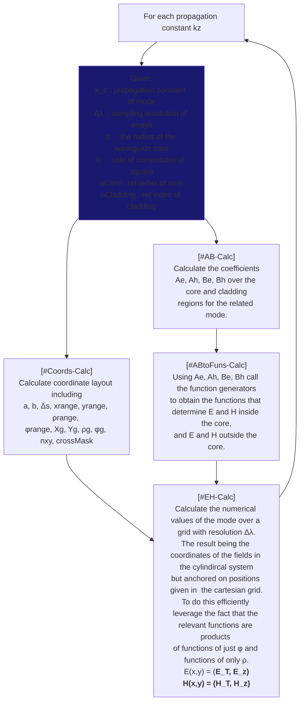

# Calculation of the numerical modal basis

Given the solution for the propagation constants of TE, TM and HE modes, calculate a numerical basis.

```mermaid
flowchart TB

FiberSol["For each propagation constant kz"]

FiberSol --> Start["Given:
k_z : propagation constant of mode
Δλ  : sampling resolution of arrays
a   : the radius of the waveguide core
b   : side of computational square
nCore : ref index of core
nCladding : ref index of cladding"]

Start --> AeAhBeBh["[#AB-Calc]
Calculate the coefficients
Ae, Ah, Be, Bh over the core and cladding
regions for the related mode."]

AeAhBeBh --> CallFuncs["[#ABtoFuns-Calc]
Using Ae, Ah, Be, Bh call the function generators
to obtain the functions that determine E and H inside the core,
and E and H outside the core."]

Start --> Coords["[#Coords-Calc]
Calculate coordinate layout including
a, b, Δs, xrange, yrange, ρrange, 
φrange, Xg, Yg, ρg, φg, nxy, crossMask
"]

Coords & CallFuncs --> Field["[#EH-Calc]
Calculate the numerical values of the mode over a grid with resolution Δλ.
The result being the coordinates of the fields in the cylindircal system
but anchored on positions given in  the cartesian grid.
To do this efficiently leverage the fact that the relevant functions are products 
of functions of just φ and functions of only ρ.
E(x,y) = (<b>E<b/>_T, E_z)
H(x,y) = (<b>H<b/>_T, H_z)"]

Field --> FiberSol

style Start fill:midnightblue
```
