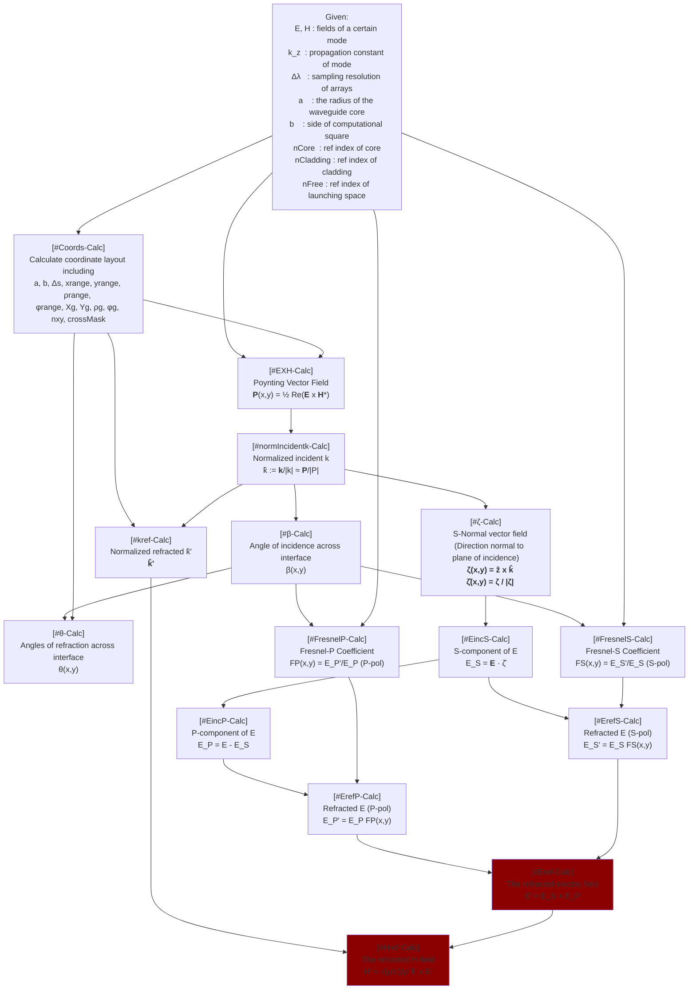

# Local-k approximation to refraction

Given a mode in the waveguide whose propagation is suddenly truncated by the end of the waveguide, find the fields right outside the fiber by using the direction of the Poynting vector as a local direction of propagation of the incident fields.

```

┌────────────────────────────────────────────────────────────────────────┐
│ ...................................................................... │
│ ...................................................................... │
│ ...............................┌──────┐............................... │
│ ...............................│E', H'│............................... │
│ ...............................└──────┘....................      ..... │
│ ...........................................................  nr  ..... │
│ ...........................................................      ..... │
│ XXXXXXXXXXXXXXXXXXXXXXXXXXXX--------------XXXXXXXXXXXXXXXXXXXXXXXXXXXX │
│ XXXXXXXXXXXXXXXXXXXXXXXXXXXX--------------XXXXXXXXXXXXXXXX        XXXX │
│ XXXXXXXXXXXXXXXXXXXXXXXXXXXX----┌────┐----XXXXXXXXXXXXXXXX n(x,y) XXXX │
│ XXXXXXXXXXXXXXXXXXXXXXXXXXXX----│E, H│----XXXXXXXXXXXXXXXX        XXXX │
│ XXXXXXXXXXXXXXXXXXXXXXXXXXXX----└────┘----XXXXXXXXXXXXXXXXXXXXXXXXXXXX │
│ XXXXXXXXXXXXXXXXXXXXXXXXXXXX--------------XXXXXXXXXXXXXXXXXXXXXXXXXXXX │
│ XXXXXXXXXXXXXXXXXXXXXXXXXXXX--------------XXXXXXXXXXXXXXXXXXXXXXXXXXXX │
│ XXXXXXXXXXXXXXXXXXXXXXXXXXXX--------------XXXXXXXXXXXXXXXXXXXXXXXXXXXX │
│                                                                        │
│                                   │                                    │
│                                                                        │
│                                   │                                    │
│                                                                        │
│                                   ├┐                      ┌────        │
│                                    └─┐  θ            ┌────┘            │
│                                   │  └─┐        ┌────┘                 │
│                                        └─┐ ┌────┘                      │
│                                   │  ┌───┴─┘                  nr       │
│       ─ ─ ─ ─ ─ ─ ─ ─ ─ ─ ─ ─ ─ ┬────┘─ ─ ─ ─ ─ ─ ─ ─ ─ ─ ─ ─ ─ ─      │
│                               ┌─┘ │                        n(x,y)      │
│                             ┌─┘                                        │
│                           ┌┬┘     │                                    │
│                         ┌─┘└─┐                                         │
│                       ┌─┘    └─┐  │                                    │
│                     ┌─┘     β  └─┐                                     │
│                   ┌─┘            └┤                                    │
│                 ┌─┘                                                    │
│                ─┘                 │                                    │
│                                                                        │
└────────────────────────────────────────────────────────────────────────┘

```


